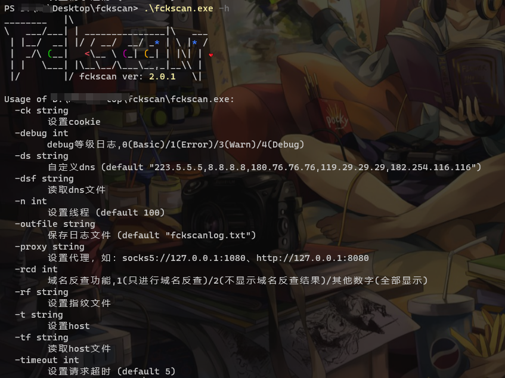
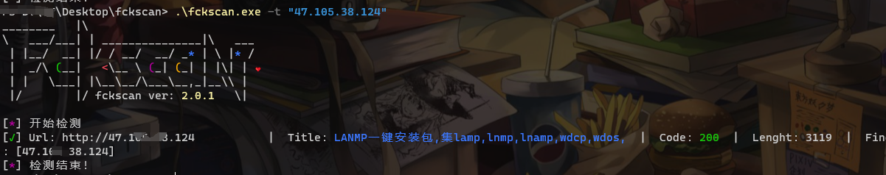
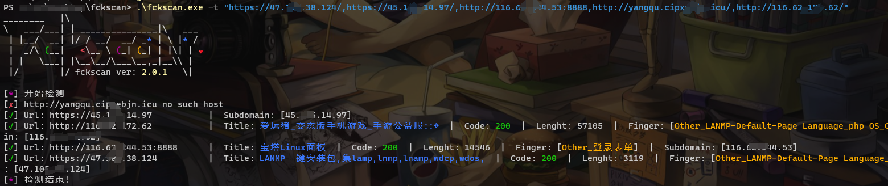
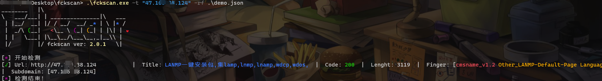
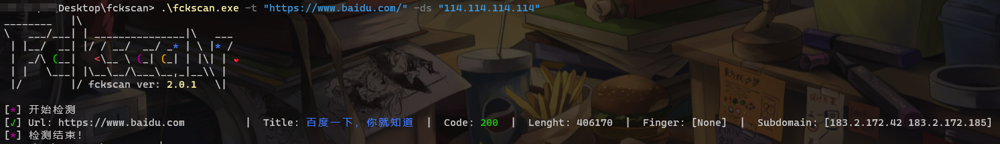
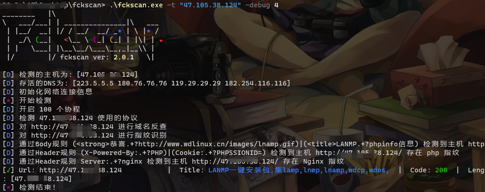

# 壹 简介

该工具原本是学`golang`用来练手的，一些编写思路借鉴了优秀项目[@fscan](https://github.com/shadow1ng/fscan)，最初的目的是用来做域名解析，但是后来写着写着就加了`web`指纹识别，工具比较水，如果有想写`golang`工具的师傅但是没有思路的话可以互相学习（虽然感觉自己项目真不咋地，指纹也不是很全，后面有空慢慢更新吧），已经写好注解，方便查看，有什么好的建议可以扣我。

# 贰 原理

- web指纹识别就是通过web指纹库进行对比
- 域名解析是通过本地域名解析+dns域名解析

# 叁 使用

- 编译

```bash
# windows
go env -w GOOS=windows
go build -o fckscan_winodws_amd64.exe -ldflags="-s -w" -trimpath  .
# linux
go env -w GOOS=linux
go build -o fckscan_linux_amd64 -ldflags="-s -w" -trimpath  .
# macOS
go env -w GOOS=darwin
go build -o fckscan_darwin_amd64 -ldflags="-s -w" -trimpath  .
```

- 帮助`-h`



- 单url识别



- 多个url识别



- 添加自定义指纹

> 注意是json格式
> - name是指纹名字
> - rules是规则，可以有多个指纹特征
>   - version是版本
>   - level是指纹危险等级
>   - path是指纹路径
>   - body\header\icon_hash分别是有明显指纹的内容特征\请求头\icon_hash（至少选择其中一个）

·icon_hash`由于使用的是`mmh3`进行提取，这里提供脚本：

```python
import mmh3,sys,codecs,requests
url = "http://127.0.0.1:8000/favicon.ico"
r = requests.get(url,verify = False)
print(mmh3.hash(codecs.encode(r.content,"base64")))
```

自定义指纹的格式文件：

```json
[
  {
    // 标准的自定义指纹写法
    "name": "cmsname",
    "rules":[
      {
      "version":   "component_v1.1",
      "level":     3,
      "path":      ["/"],
      "body":      "(index|Index)",
      "header":    "cmsname",
      "icon_hash": "1231312"
      },{
        "version":   "v1.2",
        "level":     2,
        "path":      ["/"],
        "body":      "(body|Body)"
      },{
        "level":     1,
        "path":      ["/header"],
        "header":     "(header|Header)"
      }
    ]
  },{
    // 变种的自定义写法
    "name": "cmsname1",
    "rules":[
      {
      "version":   "component1_v1.1",
      "level":     3,
      "path":      ["/"],
      "body":      "(index1|Index1)",
      "header":    "cmsname1",
      "icon_hash": "1231312"
      },{
        "version":   "v1.2",
        "level":     2,
        "path":      ["/"],
        "body":      "(body1|Body1)"
      },{
        "level":     1,
        "path":      ["/header1"],
        "header":     "(header1|Header1)"
      }
    ]
  }
]
```



- 添加自定义dns



- 设置debug模式



# 伍 更新

- v1.0.1：最初的版本
- v2.0.1：修改了一些结构和修复了bug
