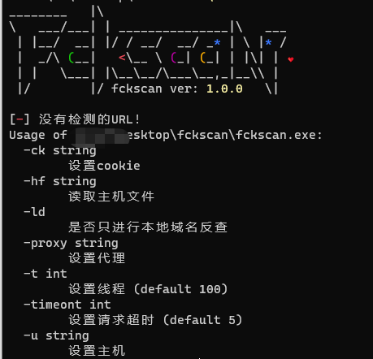
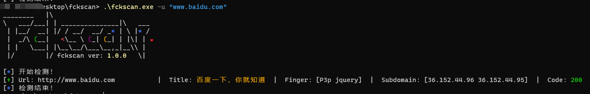
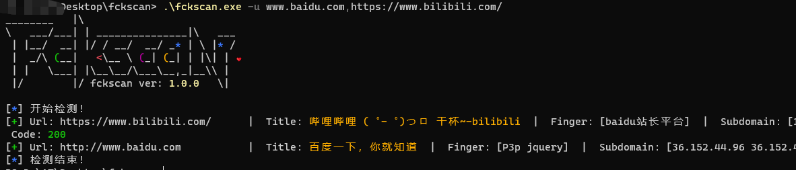
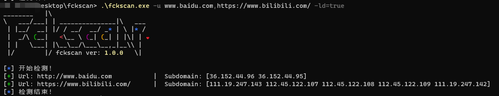
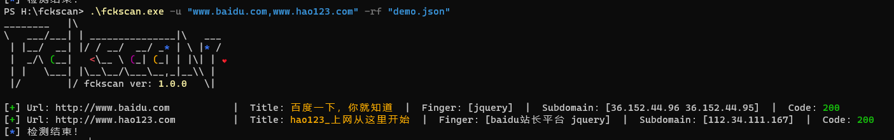
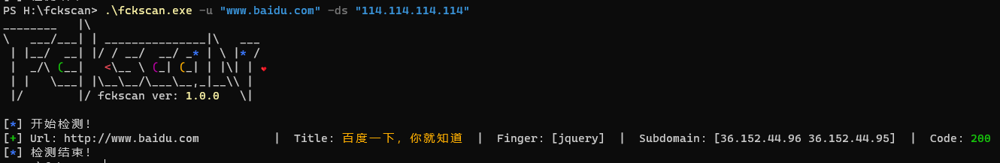

# 壹 简介

工具在重构中，当前这个版本有点辣鸡垃圾🌚
该工具主要是做web指纹识别和域名解析

# 贰 原理

web指纹识别就是通过web指纹库进行对比
域名解析是通过本地域名解析+dns域名解析

# 叁 使用

- 帮助`-h`



- 单url识别



- 多个url识别



- 只进行域名解析



- 添加自定义指纹

> 注意是json格式
> - name是指纹名字
> - type是识别的指纹类型,类型为body,headers
> - rule是规则

```json
[{"name":"cmsname", "type":"body", "rule":"demo1"},{"name":"cms2", "type":"headers", "rule":"demo2"}]
```



- 添加自定义dns


